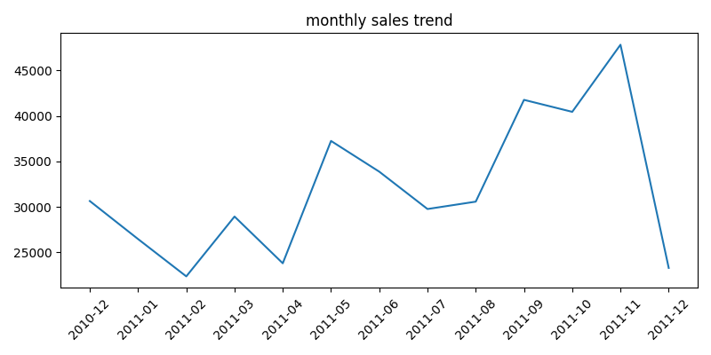
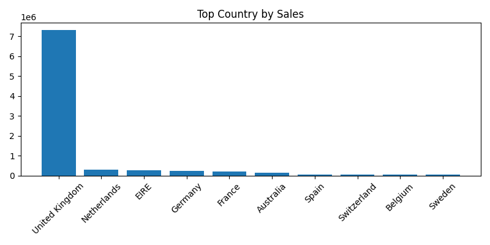
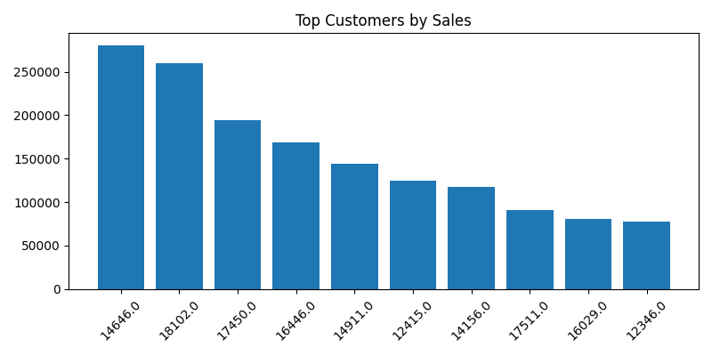

# Sales Decline Analysis

## Project Goal
Analyze the causes of sales decline using transaction data.
# Sales Decline Analysis (매출 감소 원인 분석)

## 1. 프로젝트 개요
온라인 리테일 거래 데이터를 활용하여 매출 변화의 원인을 분석하는 프로젝트입니다.  
특히 매출을 **주문수(Order Count)**와 **객단가(Average Order Value)**로 분해하여 매출 변화의 주요 요인을 분석했습니다.

---

## 2. 데이터셋
- Online Retail Dataset (UCI Machine Learning Repository)
- 영국 기반 온라인 리테일 기업의 거래 데이터

주요 컬럼

- InvoiceNo : 주문 번호  
- StockCode : 상품 코드  
- Description : 상품명  
- Quantity : 판매 수량  
- InvoiceDate : 주문 날짜  
- UnitPrice : 상품 가격  
- CustomerID : 고객 ID  
- Country : 국가  

---

## 3. 사용 기술

- SQL (SQLite)
- Python
- pandas
- matplotlib
- Git / GitHub

---

## 4. 분석 과정

### 1) 데이터 정제
- 취소 주문 제거
- 수량 및 가격이 음수인 데이터 제거

### 2) 월별 매출 집계
SQL을 활용하여 월별 매출, 주문수, 객단가를 계산했습니다.

### 3) 매출 분해 분석

매출을 다음 공식으로 분해했습니다.

매출 = 주문수 × 객단가

이를 통해 매출 변화의 주요 요인이 주문수 변화인지, 객단가 변화인지 분석했습니다.

### 4) 국가별 매출 분석
국가별 매출을 분석하여 매출 집중도를 확인했습니다.

### 5) 고객 매출 분석
매출 상위 고객을 분석하여 핵심 고객을 파악했습니다.

---

## 5. 주요 분석 결과

- 매출 증가는 객단가보다 주문수 증가의 영향이 더 큼
- 매출은 2011년 11월에 최고치를 기록
- 12월 매출 감소는 실제 감소가 아니라 데이터 기간이 불완전한 영향
- 특정 국가에 매출이 집중된 구조 확인

---

## 6. 시각화 결과

### 월별 매출 추이

### 국가별 매출 분포

### 상위 고객 매출

---

## 7. 프로젝트 구조

data/  
sql/  
python/  
result/  
README.md  

---

## 8. 프로젝트 의의
본 프로젝트는 실제 비즈니스 상황에서 발생할 수 있는 매출 감소 원인을 데이터 기반으로 분석하는 과정에 초점을 두었습니다.

SQL을 통한 데이터 집계와 Python 기반 분석 및 시각화를 결합하여  
데이터 분석 프로젝트의 전체 워크플로우를 구현했습니다.

